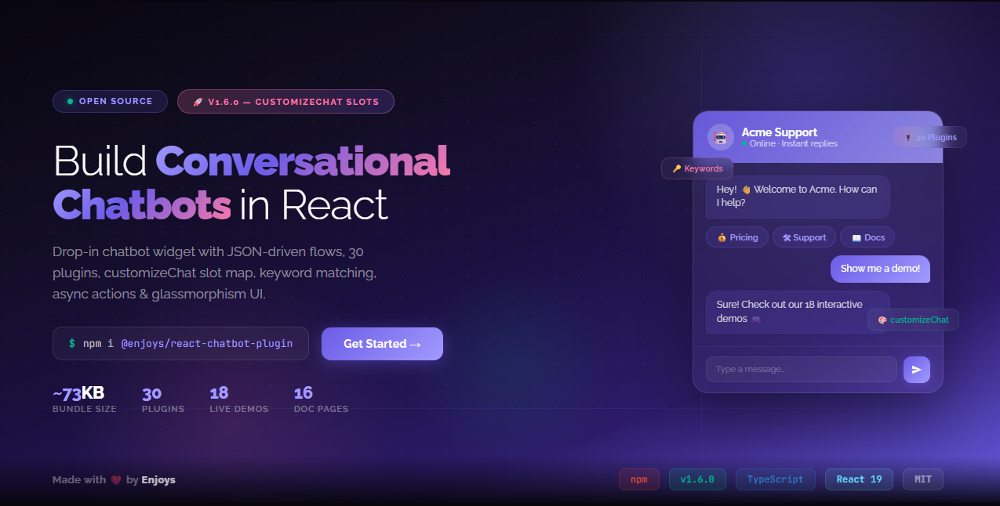

<p align="center">
  
</p>

<p align="center">
  <a href="https://github.com/enjoys-in/react-chatbot-plugin">
    
  </a>
</p>

<p align="center">
  
  
  
  
  
</p>

<h1 align="center">@enjoys/react-chatbot-plugin</h1>

<p align="center">
  <strong>A fully customizable, plugin-based chatbot widget for React.</strong><br/>
  Like tawk.to — but open-source and fully programmable.
</p>

<p align="center">
  <a href="https://www.npmjs.com/package/@enjoys/react-chatbot-plugin"><b>npm</b></a> ·
  <a href="#quick-start"><b>Quick Start</b></a> ·
  <a href="#documentation"><b>Docs</b></a> ·
  <a href="https://github.com/enjoys-in/react-chatbot-plugin/issues">Report Bug</a> ·
  <a href="https://github.com/enjoys-in/react-chatbot-plugin/issues">Request Feature</a>
</p>

---


## Features

- **JSON-driven flows** — Build conversational UIs with step-based JSON configuration
- **Keyword matching** — Route user text to responses or flow steps via pattern matching
- **Greeting detection** — Auto-respond to common greetings (hi, hello, hey, etc.)
- **Fallback responses** — Catch-all reply when no keyword or flow matches
- **Input validation** — Validate free-text input inside flow steps with transforms
- **Async actions** — Run API calls on step entry with real-time loading/progress/error states
- **Custom step components** — Render your own React widgets inside flow steps
- **Dynamic routing** — Route to different steps based on API results, status codes, or custom logic
- **Plugin architecture** — 30 built-in plugins: analytics, AI, webhooks, persistence, i18n, CRM, rate limiting, live agent, and more
- **Slash commands** — `/help`, `/back`, `/cancel`, `/restart` built-in
- **Custom header/input** — Swap the header or input with your own React components
- **Forms** — Text, select, radio, checkbox, file upload, with validation
- **Custom form fields** — Replace any form field type with your own React component
- **Theming** — Light/dark mode, CSS variables, glassmorphism design
- **File uploads** — Drag & drop, preview, size/count limits
- **Emoji picker** — Built-in emoji selector
- **Welcome & login screens** — Optional onboarding flow
- **Branding** — Customizable footer and header
- **Typing delay** — Realistic typing pause before bot replies
- **onUnhandledMessage** — Callback when nothing handles user text

## Installation

```bash
npm install @enjoys/react-chatbot-plugin
# or
yarn add @enjoys/react-chatbot-plugin
# or
pnpm add @enjoys/react-chatbot-plugin
# or
bun add @enjoys/react-chatbot-plugin
```

**Peer dependencies:** `react >= 18.0.0`, `react-dom >= 18.0.0`

## Quick Start

```tsx
import { ChatBot } from '@enjoys/react-chatbot-plugin';
import type { FlowConfig } from '@enjoys/react-chatbot-plugin';

const flow: FlowConfig = {
  startStep: 'greeting',
  steps: [
    {
      id: 'greeting',
      message: 'Hi! How can I help you?',
      quickReplies: [
        { label: 'Sales', value: 'sales', next: 'sales' },
        { label: 'Support', value: 'support', next: 'support' },
      ],
    },
    { id: 'sales', message: 'Our plans start at $29/month.' },
    { id: 'support', message: 'Please describe your issue and we will get back to you.' },
  ],
};

function App() {
  return (
    <ChatBot
      flow={flow}
      header={{ title: 'Acme Support', subtitle: 'Online', showRestart: true }}
    />
  );
}
```

## Documentation

Full documentation is available in the [`docs/`](./docs/) folder:

| # | Guide | Description |
|---|-------|-------------|
| 1 | [Getting Started](./docs/getting-started.md) | Installation, quick start, minimal example |
| 2 | [Basic Flows](./docs/basic-flows.md) | Steps, messages, quick replies, delays |
| 3 | [Forms & Validation](./docs/forms.md) | All 15 field types, validation rules, login forms |
| 4 | [Conditional Branching](./docs/conditional-branching.md) | If/else routing based on collected data |
| 5 | [Async Actions](./docs/async-actions.md) | API calls, progress messages, error handling |
| 6 | [Custom Components](./docs/custom-components.md) | React widgets inside flow steps |
| 7 | [Dynamic Routing](./docs/dynamic-routing.md) | Route based on API response status |
| 8 | [Theming & Styling](./docs/theming.md) | Colors, CSS variables, dark mode |
| 9 | [Plugins](./docs/plugins.md) | 30 built-in & custom plugins |
| 10 | [Slash Commands](./docs/slash-commands.md) | /help, /back, /restart, /cancel |
| 11 | [File Upload](./docs/file-upload.md) | Drag & drop, restrictions, previews |
| 12 | [Custom Header & Input](./docs/custom-header-input.md) | Replace header/input with React components |
| 13 | [Advanced Patterns](./docs/advanced-patterns.md) | E-commerce bot, onboarding wizard, full examples |
| 14 | [Keywords & Fallback](./docs/keywords-fallback.md) | Keyword routes, greeting detection, fallback, typing delay |
| 15 | [API Reference](./docs/api-reference.md) | All types, props, and exports |

## Props

| Prop | Type | Description |
|------|------|-------------|
| `flow` | `FlowConfig` | JSON conversation flow |
| `theme` | `ChatTheme` | Colors, fonts, border radius, light/dark mode |
| `style` | `ChatStyle` | CSS overrides for launcher, window, header, etc. |
| `header` | `HeaderConfig` | Title, subtitle, avatar, showClose, showMinimize, showRestart |
| `branding` | `BrandingConfig` | "Powered by" footer, logo |
| `welcomeScreen` | `ReactNode` | Custom welcome screen content |
| `loginForm` | `FormConfig` | Pre-chat login/identification form |
| `callbacks` | `ChatCallbacks` | Event handlers (onOpen, onClose, onMessageSend, etc.) |
| `plugins` | `ChatPlugin[]` | Array of plugins |
| `initialMessages` | `ChatMessage[]` | Pre-populated messages |
| `inputPlaceholder` | `string` | Input placeholder text |
| `position` | `'bottom-right' \| 'bottom-left'` | Widget position |
| `enableEmoji` | `boolean` | Show emoji picker |
| `fileUpload` | `FileUploadConfig` | File upload settings |
| `renderHeader` | `(ctx, defaultHeader) => ReactNode` | Custom header renderer |
| `renderInput` | `(ctx, defaultInput) => ReactNode` | Custom input renderer |
| `components` | `Record<string, ComponentType<StepComponentProps>>` | Custom React components for flow steps |
| `actionHandlers` | `Record<string, (data, ctx) => Promise<FlowActionResult>>` | Async action handlers for flow steps |
| `defaultOpen` | `boolean` | Start with chat open |
| `showLauncher` | `boolean` | Show/hide launcher button |
| `launcherIcon` | `ReactNode` | Custom launcher icon |
| `closeIcon` | `ReactNode` | Custom close icon |
| `zIndex` | `number` | CSS z-index |
| `renderFormField` | `FormFieldRenderMap` | Custom renderers for form field types |
| `className` | `string` | Root element class name |

## Exported Components

All internal components are exported for advanced use cases:

**UI:** `ChatBot`, `ChatHeader`, `ChatInput`, `ChatWindow`, `Launcher`, `MessageBubble`, `MessageList`, `QuickReplies`, `TypingIndicator`, `WelcomeScreen`, `LoginScreen`, `Branding`, `EmojiPicker`, `FileUploadButton`, `FilePreviewList`, `DynamicForm`

**Forms:** `TextField`, `SelectField`, `RadioField`, `CheckboxField`, `FileUploadField`

**Icons:** `SendIcon`, `ChatBubbleIcon`, `CloseIcon`, `MinimizeIcon`, `EmojiIcon`, `AttachmentIcon`, `FileIcon`, `ImageIcon`, `RemoveIcon`, `RestartIcon`

**Engine & Core:** `FlowEngine`, `PluginManager`, `useChat`, `ChatContext`, `useChatContext`

**Theme utilities:** `resolveTheme`, `buildStyles`, `buildCSSVariables`

**Built-in plugins:** `analyticsPlugin`, `webhookPlugin`, `persistencePlugin`, `loggerPlugin`, `crmPlugin`, `emailPlugin`, `syncPlugin`, `aiPlugin`, `intentPlugin`, `typingPlugin`, `autoReplyPlugin`, `validationPlugin`, `uploadPlugin`, `authPlugin`, `rateLimitPlugin`, `pushPlugin`, `soundPlugin`, `agentPlugin`, `transferPlugin`, `themePlugin`, `componentPlugin`, `leadPlugin`, `campaignPlugin`, `schedulerPlugin`, `reminderPlugin`, `i18nPlugin`, `debugPlugin`, `devtoolsPlugin`, `mediaPlugin`, `markdownPlugin`

## Development

```bash
# Install dependencies
bun install

# Run demo (17 interactive demos)
bun run dev

# Build library
bun run build
```

## Contributing

Contributions are welcome! Please open an issue or submit a pull request.

1. Fork the repository
2. Create your feature branch (`git checkout -b feature/amazing-feature`)
3. Commit your changes (`git commit -m 'Add amazing feature'`)
4. Push to the branch (`git push origin feature/amazing-feature`)
5. Open a Pull Request

## License

MIT © [Enjoys](https://github.com/enjoys-in)
