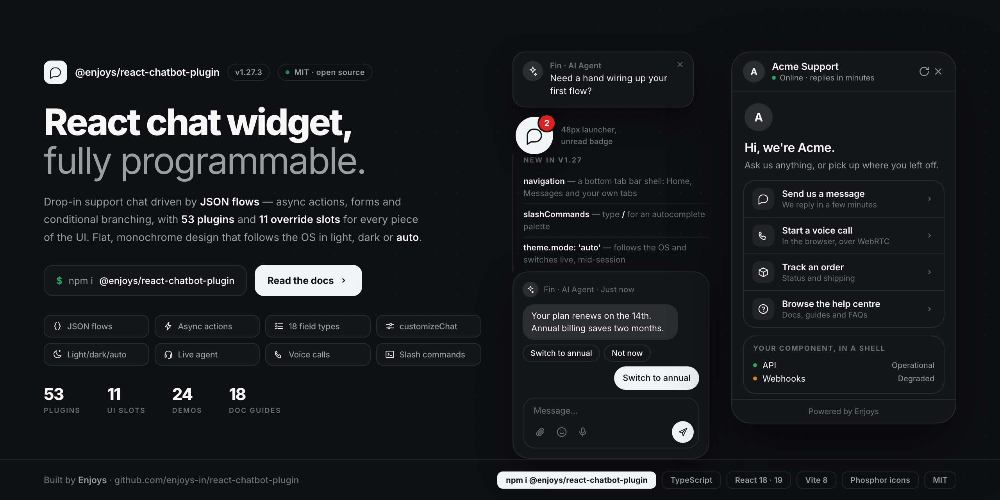

<p align="center">
  
</p>

<p align="center">
  <a href="https://github.com/enjoys-in/react-chatbot-plugin">
    
  </a>
</p>

<p align="center">
  
  
  
  
  
</p>

<h1 align="center">@enjoys/react-chatbot-plugin</h1>

<p align="center">
  <strong>A fully customizable, plugin-based chatbot widget for React.</strong><br/>
  Like tawk.to — but open-source and fully programmable.
</p>

<p align="center">
  <a href="https://www.npmjs.com/package/@enjoys/react-chatbot-plugin"><b>npm</b></a> ·
  <a href="#quick-start"><b>Quick Start</b></a> ·
  <a href="#documentation"><b>Docs</b></a> ·
  <a href="https://github.com/enjoys-in/react-chatbot-plugin/issues">Report Bug</a> ·
  <a href="https://github.com/enjoys-in/react-chatbot-plugin/issues">Request Feature</a>
</p>

---


## Features

- **JSON-driven flows** — Build conversational UIs with step-based JSON configuration
- **Keyword matching** — Route user text to responses or flow steps via pattern matching
- **Greeting detection** — Auto-respond to common greetings (hi, hello, hey, etc.)
- **Fallback responses** — Catch-all reply when no keyword or flow matches
- **Input validation** — Validate free-text input inside flow steps with transforms
- **Async actions** — Run API calls on step entry with real-time loading/progress/error states
- **Custom step components** — Render your own React widgets inside flow steps
- **Dynamic routing** — Route to different steps based on API results, status codes, or custom logic
- **Plugin architecture** — 53 built-in plugins: analytics, AI, webhooks, persistence, i18n, CRM, rate limiting, live agent, tags, rating, offline, proactive, persona, and more
- **Slash commands** — Type `/` for an autocomplete menu; `/help`, `/back`, `/cancel`, `/restart` built in, plus your own via `slashCommands`
- **`customizeChat` slot map** — All UI customization in one prop: 11 component overrides (bubble, quick replies, typing indicator, header, input, launcher, launcher notification, branding, home screen, welcome/login screen) + config (header, branding, welcome screen content)
- **Custom header/input** — Swap the header or input with your own React components
- **Forms** — Text, select, radio, checkbox, file upload, with validation
- **Custom form fields** — Replace any form field type with your own React component
- **Home screen** — Default screen with icon actions and a component shell you drop your own React components into
- **Messenger shell** — `navigation` adds a bottom tab bar (Home, Messages and your own tabs) with badges, an active indicator and per-tab components
- **Theming** — Light/dark/**auto** colour mode (follows the OS), CSS variables, derived-contrast ink, shared type-scale and motion tokens
- **File uploads** — Drag & drop, preview, size/count limits; long names truncate with the full name on hover
- **Emoji picker** — Built-in emoji selector
- **Welcome & login screens** — Optional onboarding flow
- **Branding** — Customizable footer and header
- **Typing delay** — Realistic typing pause before bot replies
- **onUnhandledMessage** — Callback when nothing handles user text
- **Live Agent (WebSocket / Socket.IO)** — Real-time handoff to human agents with session persistence, queue updates, typing indicators, and "agent joined/left" system messages
- **Message Reactions** — 👍👎 emoji reactions on messages with analytics events
- **Message Search** — Full-text search through chat history with highlighted matches
- **Voice Input** — Speech-to-text via Web Speech API with language support
- **Typing Preview** — Real-time "User is typing..." indicator for live agent/flow mode
- **Rich Cards / Carousels** — Horizontal scrollable cards with images, titles, buttons
- **Date/Time Picker** — Native date/time/datetime form field type
- **Conversation Tags** — Group and tag conversations by topic
- **Conditional Rendering** — Show/hide steps with `visibleIf` rules based on collected data
- **Flow Composition** — Reusable sub-flows via `subFlow` field
- **Middleware Pipeline** — Pre-process, transform, or block messages before dispatch
- **Event Bus** — Standalone pub/sub system via `createEventBus()`
- **Headless Mode** — Run engine + plugins without UI via `createHeadlessBot()`
- **Message Edit/Delete** — Users can edit or delete their sent messages
- **Read Receipts** — ✓ sent, ✓✓ delivered, ✓✓ read status indicators
- **Rating Plugin** — End-of-chat satisfaction survey (1-5 stars)
- **Offline Queue** — Queue messages offline, auto-send on reconnect
- **Proactive Messages** — Trigger bot messages based on page behavior (idle, scroll, exit intent)
- **Persona Switching** — Switch between bot personalities in one widget
- **Message Pinning** — Pin/unpin important messages for quick reference
- **Theme Toggle** — In-chat dark/light mode switch with persistence
- **Confetti/Animations** — Celebration effects on flow completion or custom events
- **Priority & Labels** — Set conversation urgency and custom tags
- **Whisper Mode** — Supervisor notes visible only to agents
- **Message Scheduling** — Send messages at a future time
- **Conversation Summary** — AI-powered or keyword-based conversation recap
- **Knowledge Base** — Search FAQ/docs inline and surface answers
- **Auto-Translation** — Real-time message translation between languages
- **Transcript Export** — Download chat as text, JSON, CSV, or HTML
- **Notification Badge** — Unread count on launcher + browser notifications
- **Location Sharing** — Share GPS coordinates with map links
- **Code Snippets** — Syntax-highlighted code blocks with copy button
- **Inline Polls** — Create polls with voting and result visualization
- **Payment Widget** — Stripe/Razorpay/custom payment collection inline
- **Appointment Booking** — Calendar-based slot booking with confirmation
- **Voice Calling (WebRTC)** — Start a real browser call from the chat via `voiceCallPlugin` (powered by `@enjoys/voice-widget`)
- **Proactive Launcher Notification** — A fully-customizable bubble that pops up above the launcher after a delay

---

## Release History

| Version | Features | Type | Description |
|---------|----------|------|-------------|
| **v1.27.3** | Profanity Mask Fixes | Fix | Blocked messages no longer render empty; masks only the matched words, configurable via `mask` |
| **v1.27.2** | Markdown Rendering Fixes | Fix | `markdownPlugin` no longer prints raw HTML tags; nested emphasis and horizontal rules fixed |
| **v1.27.1** | File Upload Fixes | Fix | File names in form summaries (was `[object FileList]`), ellipsis + hover-full for long names |
| **v1.27.0** | Slash Command Menu | Prop | Type `/` for an autocomplete palette; `slashCommands` for custom commands with args |
| **v1.26.0** | Home Screen, Auto Colour Mode, UI Redesign | Prop + Theme | `homeScreen` with icon actions & component shells, `mode: 'auto'`, restyled UI with measured type scale and motion tokens |
| **v1.25.0** | Proactive Launcher Notification | Slot | `customizeChat.launcherNotification` — delayed, fully-customizable popup above the launcher |
| **v1.24.0** | Voice Calling (WebRTC) | Plugin | `voiceCallPlugin` — real browser calls via `@enjoys/voice-widget` |
| **v1.23.0** | Badge, Poll, Payment, Booking, Location | Plugin | Unread badge, inline polls, payment gateway, calendar booking, GPS sharing |
| **v1.22.0** | Summary, KB, Translation, Export, Code | Plugin | AI summary, FAQ search, auto-translate, transcript download, syntax highlight |
| **v1.21.0** | Pin, Theme Toggle, Confetti, Priority, Whisper, Schedule | Plugin | Pin messages, dark/light toggle, celebrations, priority labels, agent whisper, delayed send |
| **v1.20.0** | Headless Mode | Prop + Utility | `createHeadlessBot()` + `headless` prop — run engine without UI |
| **v1.19.0** | Event Bus | Utility | `createEventBus()` standalone pub/sub utility |
| **v1.18.0** | Middleware Pipeline | Prop | `middleware` prop — intercept/transform/block messages |
| **v1.17.0** | Conditional Rendering, Flow Composition | Engine | `visibleIf` on steps + `subFlow` for reusable flows |
| **v1.16.0** | Tags, Rating, Offline, Proactive, Persona | Plugin | 5 conversation plugins |
| **v1.15.0** | Date/Time Picker | Prop (form field) | Native `date`, `time`, `datetime` form field types |
| **v1.14.0** | Rich Cards / Carousels | Prop (message) | `CarouselCards` component + `cards` message field |
| **v1.13.0** | Typing, Edit/Delete, Read Receipts | Prop | User typing indicator, message edit/delete, delivery status |
| **v1.12.0** | Voice Input | Prop | Speech-to-text via Web Speech API |
| **v1.11.0** | Message Search | Prop | Full-text search with header search bar |
| **v1.10.0** | Message Reactions | Prop | Emoji reactions on messages |
| **v1.9.0** | Live Agent | Prop + Plugin | WebSocket / Socket.IO real-time agent chat |
| **v1.8.0** | Custom Icons | Prop | `icons` prop — override any built-in icon |
| **v1.7.0** | Markdown Rendering | Prop | `markdown` prop — bold, italic, code, links, lists |
| **v1.6.0** | Keywords & Fallback | Prop | Pattern matching, greeting detection, typing delay |
| **v1.5.0** | Custom Form Fields | Prop | `renderFormField` prop — replace any form field renderer |
| **v1.4.0** | customizeChat Slot Map | Prop | 9-slot UI customization system |
| **v1.3.0** | Async Actions + Dynamic Routing | Prop | Step-entry API calls with status-based routing |
| **v1.2.0** | File Upload + Emoji Picker | Prop | Drag & drop uploads, emoji selector |
| **v1.1.0** | Plugin System | Architecture | 30 built-in plugins + custom plugin API |
| **v1.0.0** | Initial Release | Core | Flow engine, forms, theming, slash commands |

## Installation

```bash
npm install @enjoys/react-chatbot-plugin
# or
yarn add @enjoys/react-chatbot-plugin
# or
pnpm add @enjoys/react-chatbot-plugin
# or
bun add @enjoys/react-chatbot-plugin
```

**Peer dependencies:** `react >= 18.0.0`, `react-dom >= 18.0.0`

## Quick Start

```tsx
import { ChatBot } from '@enjoys/react-chatbot-plugin';
import type { FlowConfig } from '@enjoys/react-chatbot-plugin';

const flow: FlowConfig = {
  startStep: 'greeting',
  steps: [
    {
      id: 'greeting',
      message: 'Hi! How can I help you?',
      quickReplies: [
        { label: 'Sales', value: 'sales', next: 'sales' },
        { label: 'Support', value: 'support', next: 'support' },
      ],
    },
    { id: 'sales', message: 'Our plans start at $29/month.' },
    { id: 'support', message: 'Please describe your issue and we will get back to you.' },
  ],
};

function App() {
  return (
    <ChatBot
      flow={flow}
      customizeChat={{
        header: { config: { title: 'Acme Support', subtitle: 'Online', showRestart: true } },
      }}
    />
  );
}
```

## Documentation

Full documentation is available in the [`docs/`](./docs/) folder:

| # | Guide | Description |
|---|-------|-------------|
| 1 | [Getting Started](./docs/getting-started.md) | Installation, quick start, minimal example |
| 2 | [Basic Flows](./docs/basic-flows.md) | Steps, messages, quick replies, delays |
| 3 | [Forms & Validation](./docs/forms.md) | All 18 field types, validation rules, login forms |
| 4 | [Conditional Branching](./docs/conditional-branching.md) | If/else routing based on collected data |
| 5 | [Async Actions](./docs/async-actions.md) | API calls, progress messages, error handling |
| 6 | [Custom Components](./docs/custom-components.md) | React widgets inside flow steps |
| 7 | [Dynamic Routing](./docs/dynamic-routing.md) | Route based on API response status |
| 8 | [Theming & Styling](./docs/theming.md) | Colours, CSS variables, auto/dark mode, type scale, motion tokens |
| 9 | [Plugins](./docs/plugins.md) | 53 built-in & custom plugins |
| 10 | [Slash Commands](./docs/slash-commands.md) | `/` autocomplete menu, built-ins, custom commands with args |
| 11 | [File Upload](./docs/file-upload.md) | Drag & drop, restrictions, previews |
| 12 | [Custom Header & Input](./docs/custom-header-input.md) | Replace header/input with React components |
| 13 | [Advanced Patterns](./docs/advanced-patterns.md) | E-commerce bot, onboarding wizard, full examples |
| 14 | [Keywords & Fallback](./docs/keywords-fallback.md) | Keyword routes, greeting detection, fallback, typing delay |
| 15 | [API Reference](./docs/api-reference.md) | All types, props, and exports |
| 16 | [Live Agent](./docs/live-agent.md) | WebSocket / Socket.IO real-time agent chat |
| 17 | [Home Screen](./docs/home-screen.md) | Default screen: icon actions, component shells, custom slot |
| 18 | [Navigation](./docs/navigation.md) | Bottom tab bar, badges, per-tab components |
| 19 | [Changelog](./docs/changelog.md) | Version history and release notes |

## Props

| Prop | Type | Description |
|------|------|-------------|
| `flow` | `FlowConfig` | JSON conversation flow |
| `theme` | `ChatTheme` | Colours, fonts, border radius, `mode: 'light' \| 'dark' \| 'auto'` |
| `style` | `ChatStyle` | CSS overrides for launcher, window, header, etc. |
| `loginForm` | `FormConfig` | Pre-chat login/identification form |
| `homeScreen` | `HomeScreenConfig` | Default screen: greeting, icon actions, your own components |
| `slashCommands` | `SlashCommand[]` | Custom `/commands` on top of the built-ins |
| `enableSlashCommandMenu` | `boolean` | Autocomplete menu when typing `/` (default `true`) |
| `callbacks` | `ChatCallbacks` | Event handlers (onOpen, onClose, onMessageSend, etc.) |
| `plugins` | `ChatPlugin[]` | Array of plugins |
| `initialMessages` | `ChatMessage[]` | Pre-populated messages |
| `inputPlaceholder` | `string` | Input placeholder text |
| `position` | `'bottom-right' \| 'bottom-left'` | Widget position |
| `enableEmoji` | `boolean` | Show emoji picker |
| `enableReactions` | `boolean \| string[]` | Emoji reactions on messages |
| `enableSearch` | `boolean` | Message search in header |
| `enableVoice` | `boolean \| { lang?, continuous? }` | Speech-to-text input |
| `showUserTyping` | `boolean` | Show typing indicator to agents |
| `allowMessageEdit` | `boolean` | Let users edit/delete sent messages |
| `showReadReceipts` | `boolean` | Show ✓/✓✓ delivery status |
| `markdown` | `boolean \| MarkdownOptions` | Render markdown in messages |
| `fileUpload` | `FileUploadConfig` | File upload settings |
| `components` | `Record<string, ComponentType<StepComponentProps>>` | Custom React components for flow steps |
| `actionHandlers` | `Record<string, (data, ctx) => Promise<FlowActionResult>>` | Async action handlers for flow steps |
| `middleware` | `FlowMiddleware[]` | Message middleware pipeline |
| `headless` | `boolean` | Hide UI, run only engine + plugins |
| `icons` | `Partial<ChatIconMap>` | Override built-in icons |
| `defaultOpen` | `boolean` | Start with chat open |
| `showLauncher` | `boolean` | Show/hide launcher button |
| `launcherIcon` | `ReactNode` | Custom launcher icon |
| `closeIcon` | `ReactNode` | Custom close icon |
| `zIndex` | `number` | CSS z-index |
| `renderFormField` | `FormFieldRenderMap` | Custom renderers for form field types |
| `customizeChat` | `ChatCustomizeChat` | All UI customization — slot configs + component overrides |
| `liveAgent` | `LiveAgentConfig` | WebSocket / Socket.IO real-time agent chat |
| `className` | `string` | Root element class name |

### `customizeChat` Slots

Each key is a partial of its slot props — provide config, content, or a custom `component`. Only provided keys are used; missing keys use defaults. Forms (`DynamicForm` / `renderFormField`) are never affected.

| Key | Slot Props | Configurable Fields |
|-----|-----------|---------------------|
| `header` | `HeaderSlotProps` | `config: HeaderConfig`, `component` (element **or render fn** — receives `onClose`, `ctx`) |
| `input` | `InputSlotProps` | `component` (element **or render fn** — receives `onSend`, `ctx`) |
| `branding` | `BrandingSlotProps` | `config: BrandingConfig`, `component` |
| `welcomeScreen` | `WelcomeScreenSlotProps` | `content: ReactNode`, `component` |
| `loginScreen` | `LoginScreenSlotProps` | `config: FormConfig`, `component` |
| `launcher` | `LauncherSlotProps` | `component` |
| `launcherNotification` | `LauncherNotificationSlotProps` | `config: LauncherNotificationConfig`, `component` (element **or render fn**) |
| `messageBubble` | `MessageBubbleSlotProps` | `component: ComponentType` |
| `quickReplies` | `QuickRepliesSlotProps` | `component: ComponentType` |
| `typingIndicator` | `TypingIndicatorSlotProps` | `component: ComponentType` |

```tsx
<ChatBot
  flow={flow}
  customizeChat={{
    header: {
      config: { title: 'Acme Support', subtitle: 'Online', showRestart: true },
    },
    branding: {
      config: { poweredBy: 'Acme Inc', showBranding: true },
    },
    messageBubble: { component: MyCustomBubble },
    quickReplies: { component: MyCustomQuickReplies },
  }}
/>
```

### `liveAgent` — Real-time Agent Chat

Connect your chatbot to a real human agent via **WebSocket** or **Socket.IO**. Messages are relayed in real-time, with system notifications for agent join/leave, queue position, and typing indicators. Sessions persist across page refreshes.

**With Socket.IO:**

```tsx
import { io } from 'socket.io-client';

const socket = io('https://support.example.com');

<ChatBot
  flow={botFlow}
  liveAgent={{
    type: 'socketio',
    instance: socket,
    sessionId: 'user_123',
    persistSession: true,
    onAgentJoined: (agent) => console.log(`${agent.name} joined`),
  }}
/>
```

**With native WebSocket:**

```tsx
const ws = new WebSocket('wss://support.example.com/chat');

<ChatBot
  flow={botFlow}
  liveAgent={{
    type: 'ws',
    instance: ws,
    sessionId: 'user_456',
  }}
/>
```

**Or as a plugin:**

```tsx
import { liveAgentPlugin } from '@enjoys/react-chatbot-plugin';

<ChatBot
  flow={botFlow}
  plugins={[
    liveAgentPlugin({ type: 'socketio', instance: socket, sessionId: 'user_123' }),
  ]}
/>
```

| Option | Type | Default | Description |
|--------|------|---------|-------------|
| `type` | `'ws' \| 'socketio'` | — | Transport protocol |
| `instance` | `WebSocket \| Socket` | — | Pre-created connection instance |
| `sessionId` | `string` | auto | Session ID for persistence |
| `events` | `LiveAgentEvents` | defaults | Custom event name overrides |
| `persistSession` | `boolean` | `true` | Store messages in localStorage |
| `onAgentJoined` | `(agent) => void` | — | Agent joined callback |
| `onAgentLeft` | `(agent) => void` | — | Agent left callback |
| `onQueueUpdate` | `(pos, wait?) => void` | — | Queue position callback |

### `voiceCallPlugin` — In-Chat Voice Calling (WebRTC)

Let a visitor start a **real browser WebRTC call** from inside the chat. The plugin bridges the optional [`@enjoys/voice-widget`](https://www.npmjs.com/package/@enjoys/voice-widget) package (SIP-over-WebSocket under the hood) and is driven entirely by chat events — no floating call button of its own.

**Install the optional peer dependency:**

```bash
bun add @enjoys/voice-widget
```

**Usage:**

```tsx
import { ChatBot, voiceCallPlugin } from '@enjoys/react-chatbot-plugin';

<ChatBot
  flow={{
    startStep: 'greeting',
    steps: [{
      id: 'greeting',
      message: 'Need to talk to us?',
      // Selecting this quick reply starts the call (value === triggerValue)
      quickReplies: [{ label: '📞 Call us', value: '__voice_call__' }],
    }],
  }}
  plugins={[
    voiceCallPlugin({
      publicKey: 'pk_live_xxxxxxxx',        // your publishable key
      apiBase: 'https://voice.yourdomain.com', // ORIGIN only
      title: 'Talk to Support',
      triggerValue: '__voice_call__',
    }),
  ]}
/>;
```

**Trigger a call from anywhere** (e.g. a custom header/composer button) by emitting an event on the plugin manager — read it via `useChatContext()`:

```tsx
const { pluginManager } = useChatContext();
pluginManager?.emitEvent('voice:call');   // start a call
pluginManager?.emitEvent('voice:hangup'); // end it
```

| Option | Type | Default | Description |
|--------|------|---------|-------------|
| `publicKey` | `string` | — | Publishable key (`pk_…`) bound to your allowed origins |
| `apiBase` | `string` | — | Voice API **origin only** (e.g. `https://voice.acme.com`) |
| `accentColor` | `string` | — | Accent color forwarded to the widget |
| `title` | `string` | — | Call panel heading |
| `triggerValue` | `string` | `'__voice_call__'` | Quick-reply value that starts a call |
| `announce` | `boolean` | `true` | Post a bot message for each call stage |
| `onState` | `(state) => void` | — | Widget state transitions |
| `onError` | `(error) => void` | — | Validation / call errors |

> The mic permission prompt is requested **only when a call actually starts** (lazy init). The key's allowed origins must include the site you embed on.

### `customizeChat.launcherNotification` — Proactive Popup

A fully-customizable bubble that pops up **above the launcher** after a delay — like Intercom's proactive message. Clicking it opens the chat; it's dismissible and can render a completely custom component.

```tsx
<ChatBot
  flow={flow}
  customizeChat={{
    launcherNotification: {
      config: {
        delay: 3000,                 // ms before it appears (default 3000)
        heading: 'Hi there 👋',
        message: 'How can we help today?',
        sender: 'Support',
        timestamp: 'Just now',
        showClose: true,
        openOnClick: true,
        onShow: () => console.log('popup shown'),
      },
      // Or fully custom: component: (p) => <MyPopup {...p} />
    },
  }}
/>;
```

| Config Field | Type | Default | Description |
|--------------|------|---------|-------------|
| `enabled` | `boolean` | `true` | Turn the popup on/off |
| `delay` | `number` | `3000` | Delay (ms) before it appears |
| `heading` | `ReactNode` | — | Bold first line |
| `message` | `ReactNode` | — | Body text |
| `avatar` | `ReactNode \| string` | dot-grid mark | Image URL or custom node |
| `sender` | `string` | — | Name in the meta line |
| `timestamp` | `string` | `'Just now'` | Meta timestamp |
| `showClose` | `boolean` | `true` | Show the × dismiss button |
| `openOnClick` | `boolean` | `true` | Open the chat when clicked |
| `showOnce` | `boolean` | `true` | Don't reshow after dismiss (this session) |
| `backgroundColor` / `textColor` | `string` | theme | Color overrides |
| `maxWidth` | `string` | `340px` | Card max width |
| `style` | `CSSProperties` | — | Inline style overrides |
| `onShow` / `onClick` / `onDismiss` | `() => void` | — | Lifecycle callbacks |

### `homeScreen` — Default Screen

The screen the widget opens on. Icon rows route into the flow, and `sections`
let you drop your own components into a card shell that matches them.

```tsx
<ChatBot
  flow={flow}
  theme={{ mode: 'auto' }}
  homeScreen={{
    greeting: 'Hi there 👋',
    tagline: 'How can we help?',
    actions: [
      { id: 'chat',  label: 'Start a conversation', icon: <ChatIcon />,  message: 'Hello!' },
      { id: 'call',  label: 'Call us',              icon: <PhoneIcon />, href: 'tel:+15550123' },
      { id: 'order', label: 'Track an order',       icon: <BoxIcon />,   stepId: 'order' },
    ],
    sections: [
      // Wrapped in a card matching the action list
      { id: 'status', title: 'System status', component: StatusPanel },
      // Bare — your component owns the whole box
      { id: 'promo', component: <PromoBanner />, shell: false, placement: 'above' },
    ],
    cta: { label: 'Ask a question' },
  }}
  callbacks={{ onHomeAction: (id) => analytics.track('home_action', { id }) }}
/>
```

A row routes via `onSelect`, `message`, `stepId`, or `href` (rendered as a real
`<a target="_blank">`), in that order of precedence. Pass a **component** to a
section and it receives `HomeScreenContext` — `openChat`, `sendMessage`,
`goToStep`, `data`, `close` — as its props, so hooks work normally inside it.

`homeScreen` takes precedence over `customizeChat.welcomeScreen`, which keeps
working. Replace the screen entirely with `customizeChat.homeScreen.component`.

Full reference: [docs/home-screen.md](./docs/home-screen.md).

### `theme.mode: 'auto'` — Follow the OS

```tsx
<ChatBot theme={{ mode: 'auto' }} />
```

Reads `prefers-color-scheme` and switches live when the visitor changes it —
no reload. SSR-safe: renders light on the server, corrects on hydration.
`'auto'` is collapsed to a concrete mode before it reaches your components, so
`theme.mode === 'dark'` checks keep working.

Need it yourself in a custom slot:

```tsx
import { useColorScheme } from '@enjoys/react-chatbot-plugin';
const mode = useColorScheme('auto');   // 'light' | 'dark'
```

## Exported Components

All internal components are exported for advanced use cases:

**UI:** `ChatBot`, `ChatHeader`, `ChatInput`, `ChatWindow`, `Launcher`, `MessageBubble`, `MessageList`, `QuickReplies`, `TypingIndicator`, `HomeScreen`, `SlashCommandMenu`, `WelcomeScreen`, `LoginScreen`, `Branding`, `EmojiPicker`, `FileUploadButton`, `FilePreviewList`, `DynamicForm`

**Forms:** `TextField`, `SelectField`, `RadioField`, `CheckboxField`, `FileUploadField`

**Icons:** `SendIcon`, `ChatBubbleIcon`, `ChevronDownIcon`, `CloseIcon`, `MinimizeIcon`, `EmojiIcon`, `AttachmentIcon`, `FileIcon`, `ImageIcon`, `RemoveIcon`, `RestartIcon`, `SearchIcon`, `MicIcon`, `StarIcon`, `EditIcon`, `TrashIcon`

**Engine & Core:** `FlowEngine`, `PluginManager`, `BUILT_IN_COMMANDS`, `resolveCommands`, `parseCommand`, `filterCommands`, `commandMenuQuery`, `createEventBus`, `createHeadlessBot`, `LiveAgentAdapter`, `useChat`, `useLiveAgent`, `useColorScheme`, `ChatContext`, `useChatContext`

**Utilities:** `renderMarkdown`, `formatFieldValue`, `filesFromValue`, `truncateMiddle`

**Theme utilities:** `resolveTheme`, `buildStyles`, `buildCSSVariables`, `typography`, `motion`, `neutrals`, `headerInk`, `contrastInk`, `inkLayers`, `resolveColorMode`, `prefersDarkScheme`, `onColorSchemeChange`

**Built-in plugins (52):** `analyticsPlugin`, `webhookPlugin`, `persistencePlugin`, `loggerPlugin`, `crmPlugin`, `emailPlugin`, `syncPlugin`, `aiPlugin`, `intentPlugin`, `typingPlugin`, `autoReplyPlugin`, `validationPlugin`, `uploadPlugin`, `authPlugin`, `rateLimitPlugin`, `pushPlugin`, `soundPlugin`, `agentPlugin`, `transferPlugin`, `themePlugin`, `componentPlugin`, `leadPlugin`, `campaignPlugin`, `schedulerPlugin`, `reminderPlugin`, `i18nPlugin`, `debugPlugin`, `devtoolsPlugin`, `mediaPlugin`, `markdownPlugin`, `liveAgentPlugin`, `tagsPlugin`, `ratingPlugin`, `offlinePlugin`, `proactivePlugin`, `personaPlugin`, `pinPlugin`, `themeTogglePlugin`, `confettiPlugin`, `priorityPlugin`, `whisperPlugin`, `messageSchedulePlugin`, `notificationBadgePlugin`, `summaryPlugin`, `knowledgeBasePlugin`, `translationPlugin`, `transcriptExportPlugin`, `codeHighlightPlugin`, `pollPlugin`, `paymentPlugin`, `bookingPlugin`, `locationPlugin`, `voiceCallPlugin`

## Development

```bash
# Install dependencies
bun install

# Run demo (23 interactive demos)
bun run dev

# Build library
bun run build
```

## Contributing

Contributions are welcome! Please open an issue or submit a pull request.

1. Fork the repository
2. Create your feature branch (`git checkout -b feature/amazing-feature`)
3. Commit your changes (`git commit -m 'Add amazing feature'`)
4. Push to the branch (`git push origin feature/amazing-feature`)
5. Open a Pull Request

## License

MIT © [Enjoys](https://github.com/enjoys-in)
